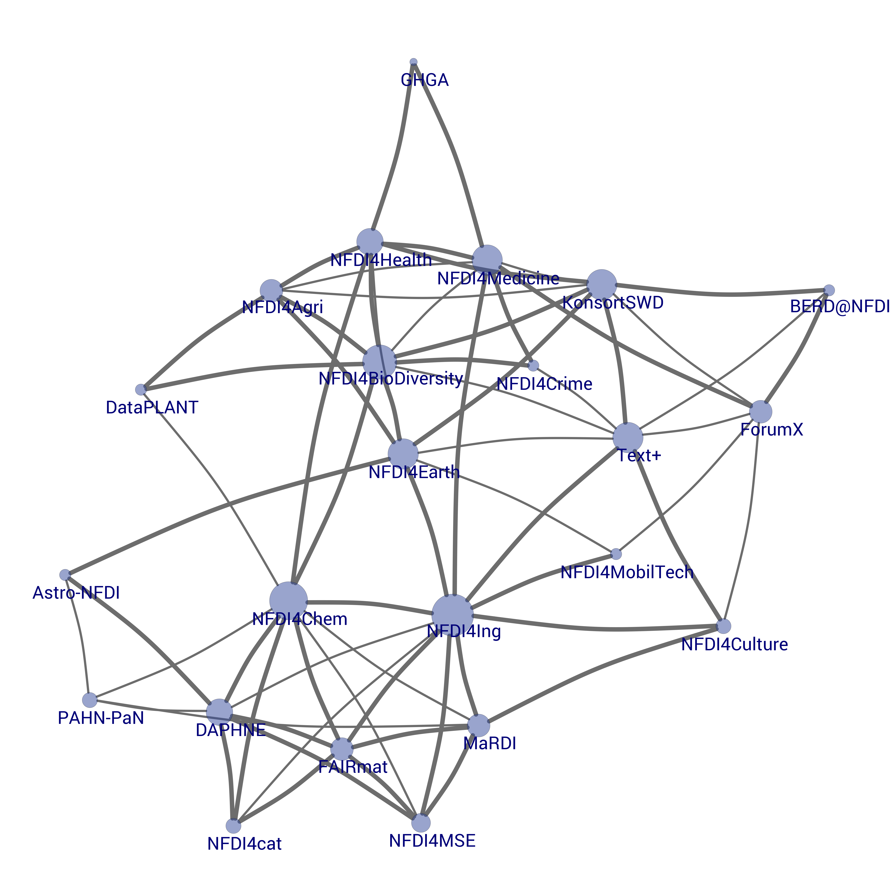
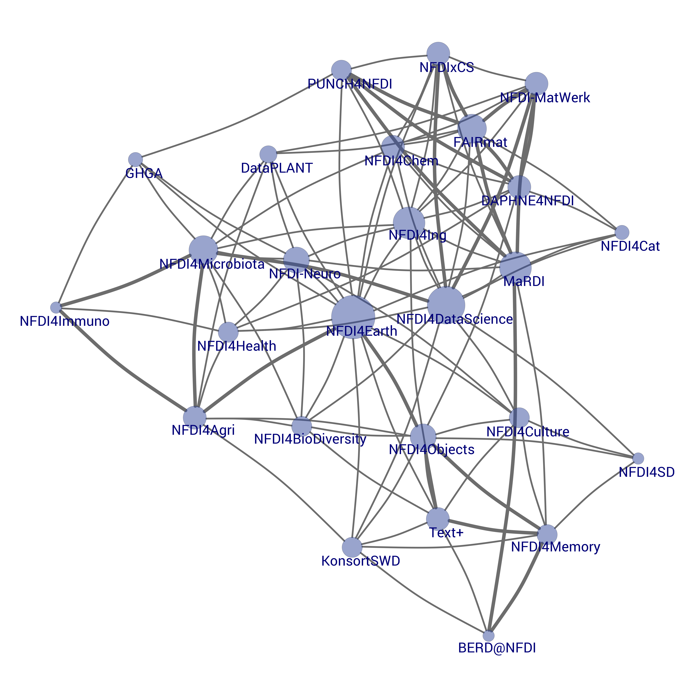

# NFDI_Network

> This repo is a fork from https://github.com/dorothearrr/NFDI_Netzwerk.

It takes the sources of the original repo and remodels some networks.

There is also a community detection and interactive chorddiagram as well as an interactive network (`.html`).

To get all the files run

> `make` 

in your CLI

or execute the script `nfdi_network.R` with R.

## Examples

| 2019                                                                                                        | 2020                                                                                                        |
|-------------------------------------------------------------------------------------------------------------|-------------------------------------------------------------------------------------------------------------|
|                        |                       |
| ["](/2019/2019_nfdi_network_3.png) | [" ](/2020/2020_nfdi_network_3.png) |
